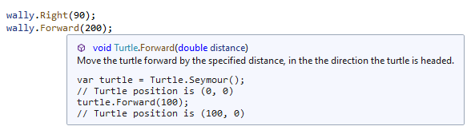
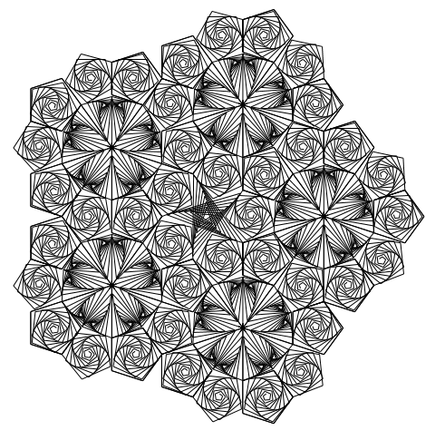

# Woopec: Turtle-Class

## Introduction

> Turtle graphics is a popular way for introducing programming to kids. It was part of the original Logo programming language developed by Wally Feurzeig, Seymour Papert and Cynthia Solomon in 1967.
> >
> Imagine a robotic turtle starting at (0, 0) in the x-y plane. [...] give it the command turtle.Forward(15), and it moves (on-screen!) 15 pixels in the direction it is facing, drawing a line as it moves. Give it the command turtle.Right(25), and it rotates in-place 25 degrees clockwise.
>
> Turtle can draw intricate shapes using programs that repeat simple moves. By combining together these and similar commands, intricate shapes and pictures can easily be drawn

This quote from the documentation of the [pyhton-Turtle-Graphics](https://docs.python.org/3/library/turtle.html#module-turtle) describes the advantages of turtle Graphics.

Woopec-turtle is an attempt to make something similar available to C# developers as well. 

The structure (methods and their names) was largely taken over from python. Some things have been adapted to C# (upper/lower case, properties). The range of functions does not come close to that of the great python library. But it's a first step.

## Examples

Let's start with a simple example:
```csharp
    var turtle = Turtle.Seymour();

    turtle.Right(45);
    turtle.Forward(50);
    turtle.Left(90);
    turtle.Forward(100);
    turtle.Right(45);
    turtle.Forward(20);
```
This code produces the following result:


The previous example used a predefined turtle `Turtle.Seymour()`. It is also possible to create several turtles.
The following example creates two turtles, cynthia and wally. In this example at first cynthia will turn left and 
move forward, and then wally will turn right and move forward:
```csharp
    var cynthia = new Turtle();
    cynthia.Speed = Speeds.Slowest;
    cynthia.Left(90);
    cynthia.Forward(200);

    var wally = new Turtle();
    wally.Speed = Speeds.Slowest;
    wally.Right(90);
    wally.Forward(200);
```

But what can you do if you want him and her to move at the same time? In this case, *both* turtles must be created *before*
the first move is performed. In this example cynthia and wally will move at the same time:
```csharp
    var cynthia = new Turtle();
    cynthia.Speed = Speeds.Slowest;

    var wally = new Turtle();
    wally.Speed = Speeds.Slowest;

    cynthia.Left(90);
    cynthia.Forward(200);

    wally.Right(90);
    wally.Forward(200);
```

## How to write your own program?

You only have to install Visual Studio (Community Edition, or Visual Studio Code) and the [Woopec.Wpf-Library](https://www.nuget.org/packages/Woopec.Wpf). 
All of these are free to use. For your program you create a Visual Studio Project of type 
"WPF Application", add the Woopec-library and add the WoopecCanvas to your MainWindow. 
Then you can write your first turtle program. [Getting started](./GettingStarted.md) describes this in more detail.


Your program must have a main-method named `TurtleMain()`, this method is started automatically:

```csharp
    public static void TurtleMain()
    {
        var turtle = Turtle.Seymour();
        turtle.Forward(50);
    }
```

Because Woopec (currently) uses WPF, the code must run on a Windows Computer.

## Overview of Methods

The following table gives a short overview of all methods. The methods are described in more detail by code comments.
The IntelliSense-Feature of Visual Studio shows these comments when you move the mouse over the name of the method:



| Method                                           | Description                                           |
|--------------------------------------------------|-------------------------------------------------------|
| **Move, Draw and Position State:**
| Forward(double distance)                         | Move forward                                          |
| Backward(double distance)                        | Move backward                                         |
| Left(double angle)                               | Rotate left                                           |
| Right(double angle)                              | Rotate right                                          |
| SetPosition(Vec2D position) GoTo(Vec2D position) | Change position.                                      |
| Position [Type is Vec2D]                         | Get or change position                                |
| SetHeading(double angle)                         | Change heading (rotate to this heading)               |
| Heading [Type is double]                         | Get or change heading                                 |
| Speed [Type is Speed]                            | Get or change speed                                 |
| **Drawing state:**
| PenUp()                                          | Pull the pen down – drawing when moving                                                       |
| PenDown()                                        | Pull the pen up – no drawing when moving                                                       |
| IsDown [Type is bool]                            | Get or change state of pen                            |
| **Color control:**
| PenColor [Type is Color]                         | Pencolor                                              |
| FillColor [Type is Color]                        | Fillcolor                                             |
| Color [Type is Color]                            | Change pencolor and fillcolor                         |
| **Visibility and appearance:**
| HideTurtle()                                     | Make the turtle invisible                             |
| ShowTurtle()                                     | Make the turtle visible                               |
| IsVisible (Type is bool)                         | True if turtle is shown, false if is hidden           |
| Shape (Type is a Shape)                          | Get or change shape of the turtle                     |
| **Filling:**
| BeginFill()                                      | Start the filling                                     |
| EndFill()                                        | Fill the shape drawn after the last call of BeginFill()|
| Filling (Type is bool)                           | Return fillstate (true if filling, false else)        |

## More Examples

The library contains a few demo programs. All of these programs are in the namespace
`Woopec.Examples`. The following code calls the C# version of the [pyhton ByteDesignDemo](https://github.com/python/cpython/blob/main/Lib/turtledemo/bytedesign.py) 

```csharp
    public static void TurtleMain()
    {
        Woopec.Examples.TurtleDemoByteDesign.Run();
    }
```

This example generates the following picture in just a few seconds:




**And now: Write your own programs and have fun.**


