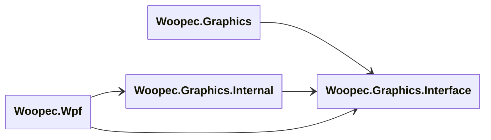
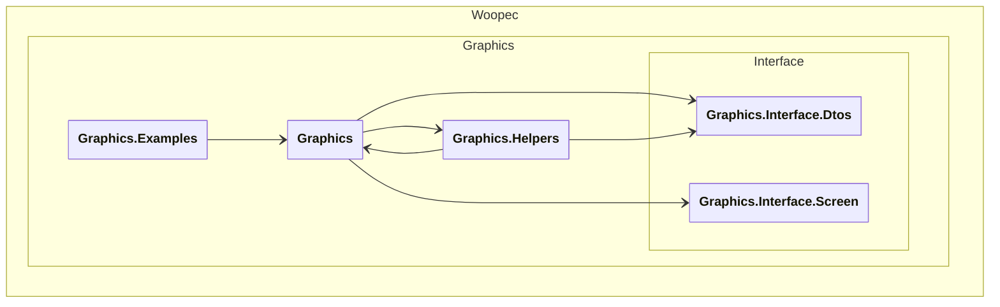
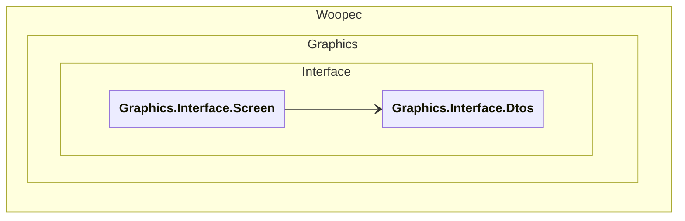
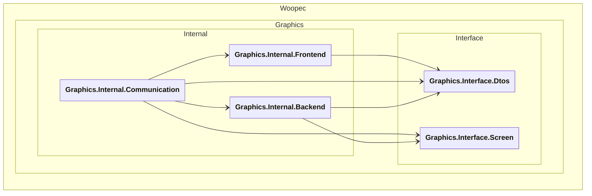
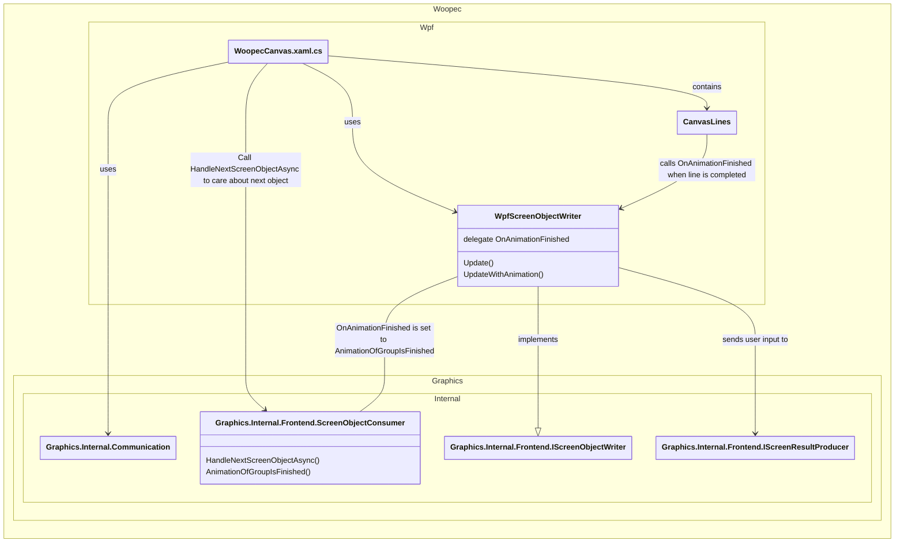

# Architecture

Solange das hier sowieso niemanden außer mir interessiert, kann ich hier auch alles auf Deutsch schreiben.

## 1 Introduction & Goals

C# ist eine großartige Programmiersprache. Eigentlich auch gut zu lernen und mit wenig Einstiegshürden. Allerdings nur solange man sich auf Consolen-Programme beschränkt. Aber wer will das schon, wenn sie/er eine Programmiersprache lernt. In anderen Sprachen ist das viel besser. In python kann man beispielsweise Turtle-Graphics nutzen und auch als Anfänger ganz leicht Programme mit Grafik programmieren. Das will ich auch für C# erreichen.

Diese Library soll absoluten Programmier-Anfänger ermöglichen, mit C# erste grafische Programme zu schreiben.

Daraus ergeben sich diese Haupt-Qualitätsziele:

* Die Befehle der Library müssen sehr leicht zu verstehen und zu benutzen sein.
* Debugging ist eine super Methode, um den geschriebenen Code nachzuvollziehen. Darum muss Debugging von Programmen, die man mit dieser Library geschrieben hat, leicht sein.
* Die Library soll auch noch für etwas fortschrittlichere Aufgaben nutzbar sein. Darum muss die Performance gut sein. Und es soll möglich sein, zeitlich parallel verschiedene Dinge auf dem Bildschirm zu animieren.

## 2 Constraints

Alles soll kostenlos nutzbar sein. Wichtig ist auch, dass ein Programmiereinsteiger auf seinem Rechner alle notwendigen Dinge schnell an den Start bringen kann. Logischerweise ist C# als Programmiersprache gesetzt. 

Eigentlich wäre es schön, wenn es geringe Systemvoraussetzungen für den Rechner des Anwenders gäbe. Man könnte beispielsweise fordern, dass ein funktionierender Browser ausreicht. Das war mir zu kompliziert und zu einschränkend. Darum gehe ich davon aus, dass der Anwender einen Rechner hat, auf dem er eine C# Entwicklungsumgebung einrichten kann. Schön wäre es, wenn das nicht zwingend ein Windows-Rechner sein müsste. Aktuell funktioniert es (wegen der Nutzung von WPF) aber nur auf Windows-Rechnern.

## 3 Context & Scope

Der User programmiert ein C# Programm. In diesem C# Programm nutzt sie die Objekte der Woopec Library. Das Programm wird auf dem Bildschirm ausgeführt. Währenddessen kann der User sich das Programm ansehen und es auch gleichzeitig debuggen.

.png)


## 4 Solution Strategy

Die wesentlichen Lösungsideen:

* Die Befehle und Objekte orientieren sich stark an [Python Turtle Graphics](https://docs.python.org/3/library/turtle.html#module-turtle). Das ist für Anfänger gut geeignet.

* Es soll auch möglich sein, mehrere Objekte (Turtles) auf dem Bildschirm gleichzeitig zu animieren. Das wollte ich nicht selbst implementieren und habe darum WPF benutzt. WPF funktioniert nur unter Windows. Damit man das später mal auf eine andere Technologie (vermutlich AvaloniaUI) umstellen kann, werden Woopec-Kern und Woopec-WPF gut entkoppelt.

* Einfaches Debuggen ist tricky:
  Der Programmieranfänger möchte eigentlich so etwas programmieren:

  ```csharp
  Turtle.Forward(50);
  Turtle.Left(90);
  Turtle.Forward(50);
  ```

  Dann möchte er mit dem Debugger durch diese Kommandos steppen und auf dem Bildschirm sehen, dass sich seine Turtle wie angegeben bewegt. 
  Der einfachste Implementierungsansatz wäre: Über ein UI-Event wird der obige Code aufgerufen, die Turtle-Befehle werden in UI-Befehle umgewandelt, und dann geht die Kontrolle wieder an das UI. Dieser Ansatz führt aber dazu, dass beim Debuggen obiger Zeilen auf dem UI *nichts passiert*, denn das UI hat noch nicht die Kontrolle zurück.
  Darum ist das hier anders gelöst: Beim Debuggen werden zwei Prozesse gestartet: Der eine Prozess durchläuft die Turtle Kommandos und übermittelt sie über einen Channel an den zweiten Prozess. Der zweite Prozess ist der UI-Prozess. Dieser nimmt die UI-Kommandos auf und zeigt sie an.

## 5 Building Block View

### 5.1 Gesamtsystem

Auf der obersten Ebene besteht das Programm des Benutzers aus dem individuellen Code des Benutzers und den beiden Libraries Woopec.WPF und Woopec.Core:

.png)

Erläuterungen:

| Block           | Erläuterung                                                  |
| --------------- | ------------------------------------------------------------ |
| Woopec.Graphics | Diese Library enthält die Klassen (z.B. `Turtle`) und Methoden (z.B. `Left`), die der User in seinem Code verwendet. Die Library erzeugt dementsprechend Änderungsbefehle für das UI, die über einen Channel an Woopec.WPF weitergegeben werden. Informationen vom UI (z.B. im UI eingegebene Texte) werden aus einem zweiten Rückkanal gelesen |
| Woopec.WPF      | Diese Library liest die Änderungsbefehle aus dem Channel und zeigt die Änderungen in einem WPF UserControl `WoopecCanvas` an. Im UI erfasste Informationen (z.B. im UI eingegebene Texte) werden in einen Rückkanal geschrieben. |
| C# code of user | Der C# code des Users nutzt in seinem Main Window ein UI-Control vom Typ `WoopecCanvas`, in dem die Woopec-Objekte angezeigt werden. Der Code des Benutzers muss eine Methode mit Namen `WoopecMain` enthalten. In dieser Methode (und von ihr aufgerufenen Methoden) benutzt der Anwender die Klassen (z.B. `Turtle`) und Methoden (z.B. `Left`) von Woopec.Core, um die gewünschten Grafiken zu zeichnen. |
| Channels        | Channels zum Austausch der Daten zwischen Woopec.Graphics Library und dem Frontend |

### 5.2 Level 2

Der Code besteht aus vier Blöcken:



Erläuterungen der Namespaces:

| Block                     | Erläuterung                                                  |
| ------------------------- | ------------------------------------------------------------ |
| Woopec.Graphics           | Dieser Namespace enthält die Klassen, die von Usern verwendet werden können (Turtle, Figure, Pen, etc.). Diese Klassen sind in der öffentlichen [Woopec Dokumentation](https://frank.woopec.net/woopec-docs-index.html) beschrieben |
| Woopec.Graphics.Interface | Enthält Data Transfer Objects (DTOs), die zwischen Woopec.Graphics und dem UI ausgetauscht werden, und ein Interface zu einem logischen Screen (LowLevelScreen) an den Woopec.Graphics diese DTOs schickt bzw. von dort empfängt.<br />Woopec.Graphics nutzt nur dieses Interface und ist so vom Rest entkoppelt |
| Woopec.Graphics.Internal  | Wie in Abschnitt 5.1 erläutert, tauscht Woopec.Graphics über Channels Informationen mit dem UI aus. Diese Logik ist hier implementiert. Hier werden auch alle Enden miteinander verknüpft. |
| Woopec.Wpf                | Der Code, der das echte UI implementiert (mit Windows WPF).  |


### 5.2 Level 3

#### 5.2.1 Woopec.Graphics

Das Projekt Woopec.Graphics enthält die Klassen, die ein externer User benutzt, und ein bisschen Hilfs-Code.



Diese Namespaces gehören zum Projekt Woopec.Graphics:

| Namespace                | Erläuterung                                                  |
| ------------------------ | ------------------------------------------------------------ |
| Woopec.Graphics          | Dieser Namespace enthält die Klassen, die von Usern verwendet werden können (Turtle, Figure, Pen, etc.). Diese Klassen sind in der öffentlichen [Woopec Dokumentation](https://frank.woopec.net/woopec-docs-index.html) beschrieben |
| Woopec.Graphics.Examples | Beispielprogramme mit Woopec.Graphics                        |
| Woopec.Graphics.Helper   | Einfache interne Hilfs-Objekte, die von Woopec.Graphics benutzt werden (alle `internal`) |

Die obigen drei Namespaces nutzen ausschließlich Code aus Woopec.Graphics.Interface und sind auf diese Weise vom Rest entkoppelt.

#### 5.2.2 Woopec.Graphics.Interface

Der Namespace Woopec.Graphics.Interface entkoppelt Woopec.Graphics vom Rest des Codes.


Es gibt zwei Unter-Namespaces:

| Namespace                        | Erläuterung                                                  |
| -------------------------------- | ------------------------------------------------------------ |
| Woopec.Graphics.Interface.Dtos   | Data Transfer Objects, die im wesentlichen in Woopec.Graphics erzeugt werden und von dort an einen logischen Screen geschickt werden, dessen Interface in Graphics.Interface.Screen definiert ist. |
| Woopec.Graphics.Interface.Screen | Enthält das Interface zu einem logischen Screen, an den Woopec.Graphics Daten schickt, von dem Woopec.Graphics aber auch Daten empfängt (User-Input). |

Dieser Namenspace wird von allen anderen Namespaces genutzt. Alle anderen Namespaces nutzen die DTOs. Im Namespace Woopec.Graphics.Internal befinden sich Implementierungen der Interfaces aus Graphics.Interface.Screen.

#### 5.2.3 Woopec.Graphics.Internal

Der Namespace Woopec.Graphics.Internal bildet den Kern der Funktionalität ab.

Hier findet die Entkopplung von Backend und Frontend statt.




| Block                             | Erläuterung                                                  |
| --------------------------------- | ------------------------------------------------------------ |
| Woopec.Graphics.Internal.Backend  | Dies ist das Backend, das  Woopec.Graphics Befehle (wie Turtle.Forward) aufnimmt und Ergebnisse (z.B. Tastatur-Input) an Woopec.Graphics zurück gibt. Für die Kommunikation mit dem Frontend werden Interfaces für Channels benutzt, die in Graphics.Internal.Communication realisiert sind. |
| Woopec.Graphics.Internal.Frontend | Dies ist der abstrakte Teil des Frontends. Hier werden DTOs aus dem Channel gelesen und an ein Interface (`IScreenObjectWriter`) weitergegeben, das in Wpf implementiert ist. Analog wird für Wpf ein Interface bereitgestellt (`IScreenResultProducer`) bereitgestellt, an das Wpf User-Input übergeben kann. |
| Woopec.Graphics.Communication     | Hier werden Frontend und Backend miteinander verknüpft.      |


#### 5.2.4. Woopec.Wpf

Woopec.Wpf realisiert das UI mit Windows WPF. Im folgenden Schaubild sind nur die wesentlichen Zusammenhänge visualisiert.




Erläuterungen der obigen Objekte:

| Block                 | Erläuterung                                                  |
| --------------------- | ------------------------------------------------------------ |
| WoopecCanvas.xaml.cs  | WPF Canvas, der die Grafiken anzeigt. Zu Beginn wird Code aus Graphics.Internal.Communication aufgerufen, um alles richtig zu initiieren. Der Code hinter diesem Canvas triggert über Aufruf von HandleNextScreenObjectAsync() das Lesen weiterer Objekte aus dem Channel. |
| WpfScreenObjektWriter | Sorgt dafür, dass die Objekte im Canvas gezeichnet werden. Implementiert einen IScreenObjectWriter, der von einem ScreenObjectConsumer mit neuen Objekten versorgt wird (über Aufruf von `Update()` oder `UpdateWithAnimation()`, oben nicht eingezeichnet) |
| CanvasLines           | Eine Linie, die ggf. animiert im Canvas gezeichnet wird. Diese Linien werden (nicht eingezeichnet) vom WpfScreenObjectWriter erzeugt. Eine Linie kann animiert sein, d.h. sie wird auf dem Bildschirm animiert. Wenn die Animation beendet ist, wird diese Information an das Delegate `OnAnimationFinished` des WpfScreenObjectWriters weitergegeben. Dieses Delegate ist auf die Methode `AnimationOfGroupIsFinished()` des ScreenObjectConsumers gesetzt. Auf diesem Weg erhält der Consumer, dass eine Animation beendet wurde. Er kann dann prüfen, ob es Objekte gibt, die auf die Beendigung dieser Animation gewartet haben. Diese Objekte können dann gezeichnet werden. |
|                       |                                                              |
|                       |                                                              |

## 6 Runtime View

## 7 Deployment View

## 8 Crosscutting Concepts

## 9 Architectural Decisions

## 10 Quality Requirements

## 11 Risks & Technical Debt

## 12 Glossary


