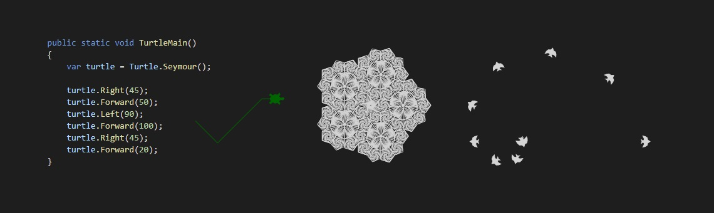

<!--
*** Template for this readme copied from https://github.com/othneildrew/Best-README-Template
-->

<!-- PROJECT SHIELDS -->
<!--
*** I'm using markdown "reference style" links for readability.
*** Reference links are enclosed in brackets [ ] instead of parentheses ( ).
*** See the bottom of this document for the declaration of the reference variables
*** for contributors-url, forks-url, etc. This is an optional, concise syntax you may use.
*** https://www.markdownguide.org/basic-syntax/#reference-style-links
[![Contributors][contributors-shield]][contributors-url]
[![Forks][forks-shield]][forks-url]
[![Stargazers][stars-shield]][stars-url]
[![Issues][issues-shield]][issues-url]
[![MIT License][license-shield]][license-url]
[![LinkedIn][linkedin-shield]][linkedin-url]
-->

<!-- PROJECT LOGO -->
 

  

  <h3 align="center">Woopec</h3>

  

    Simple graphics for C# beginners (starting with turtle graphics)
     
    <a href="https://woopec.wordpress.com/documentation-turtle-class/"><strong>Explore the docs »</strong></a>
  

<!-- TABLE OF CONTENTS -->

  
Table of Contents

  <ol>
    <li>
      <a href="#about-the-project">About The Project</a>
      <ul>
        <li><a href="#built-with">Built With</a></li>
      </ul>
    </li>
    <li>
      <a href="#getting-started">Getting Started</a>
      <ul>
        <li><a href="#prerequisites">Prerequisites</a></li>
        <li><a href="#installation">Installation</a></li>
      </ul>
    </li>
    <li><a href="#usage">Usage</a></li>
    <li><a href="#roadmap">Roadmap</a></li>
    <li><a href="#license">License</a></li>
    <li><a href="#contact">Contact</a></li>
    <li><a href="#acknowledgements">Acknowledgements</a></li>
  </ol>

<!-- ABOUT THE PROJECT -->
## About The Project

Programming is fun. Programming with graphics is even more fun. C# is a great programming language. For beginners there should be an easy start to graphic programming with C#. Woopec tries to help – it’s free.

The first version contains turtle graphics. There is a [great implementation](https://docs.python.org/3/library/turtle.html#module-turtle) of turtle graphics in python.
I tried to bring the first parts of it into the C# world.

### Built With

* [C# and .NET 5](https://docs.microsoft.com/en-us/dotnet/core/dotnet-five)

<!-- GETTING STARTED -->
## Getting Started

To debug and run this project locally...

### Prerequisites

* Visual Studio 2019
* Windows Computer

### Installation

* Clone the repo
* Open the solution in Visual Studio
* Build the solution
* Set `UsingTurtleCanvas` as active project
* Call Debug - Start without Debugging

<!-- USAGE EXAMPLES -->
## Usage

There is a [nuget-package](https://www.nuget.org/packages/Woopec.Wpf) for usage of Woopec in 
WPF-applications. 

_For more examples, please refer to the [Documentation](https://woopec.wordpress.com/)_

<!-- ROADMAP -->
## Roadmap

This is a first version. The code has not yet been cleaned up properly. I will continue in winter...

<!-- CONTRIBUTING 
## Contributing

Contributions are what make the open source community such an amazing place to be learn, inspire, and create. Any contributions you make are **greatly appreciated**.

1. Fork the Project
2. Create your Feature Branch (`git checkout -b feature/AmazingFeature`)
3. Commit your Changes (`git commit -m 'Add some AmazingFeature'`)
4. Push to the Branch (`git push origin feature/AmazingFeature`)
5. Open a Pull Request
-->

<!-- LICENSE -->
## License

Distributed under the MIT License. See `LICENSE` for more information.

<!-- CONTACT -->
## Contact

Frank Kruse - woopec.graphics@gmail.com

Project Link: [https://github.com/FrankFK/simple-graphics-for-csharp-beginners](https://github.com/FrankFK/simple-graphics-for-csharp-beginners)

<!-- ACKNOWLEDGEMENTS -->
## Acknowledgements
* [Python Turtle graphics](https://docs.python.org/3/library/turtle.html#module-turtle)
* [othneildrew/Best-README-Template](https://github.com/othneildrew/Best-README-Template)

<!-- MARKDOWN LINKS & IMAGES -->
<!-- https://www.markdownguide.org/basic-syntax/#reference-style-links -->
<!--
[contributors-shield]: https://img.shields.io/github/contributors/othneildrew/Best-README-Template.svg?style=for-the-badge
[contributors-url]: https://github.com/othneildrew/Best-README-Template/graphs/contributors
[forks-shield]: https://img.shields.io/github/forks/othneildrew/Best-README-Template.svg?style=for-the-badge
[forks-url]: https://github.com/othneildrew/Best-README-Template/network/members
[stars-shield]: https://img.shields.io/github/stars/othneildrew/Best-README-Template.svg?style=for-the-badge
[stars-url]: https://github.com/othneildrew/Best-README-Template/stargazers
[issues-shield]: https://img.shields.io/github/issues/othneildrew/Best-README-Template.svg?style=for-the-badge
[issues-url]: https://github.com/othneildrew/Best-README-Template/issues
[license-shield]: https://img.shields.io/github/license/othneildrew/Best-README-Template.svg?style=for-the-badge
[license-url]: https://github.com/othneildrew/Best-README-Template/blob/master/LICENSE.txt
[linkedin-shield]: https://img.shields.io/badge/-LinkedIn-black.svg?style=for-the-badge&logo=linkedin&colorB=555
[linkedin-url]: https://linkedin.com/in/othneildrew
[product-screenshot]: images/screenshot.png
-->