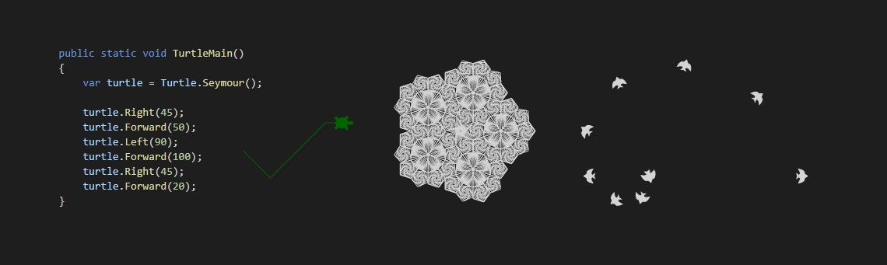

<!--
*** Template for this readme copied from https://github.com/othneildrew/Best-README-Template
-->


<!-- PROJECT SHIELDS -->
<!--
*** I'm using markdown "reference style" links for readability.
*** Reference links are enclosed in brackets [ ] instead of parentheses ( ).
*** See the bottom of this document for the declaration of the reference variables
*** for contributors-url, forks-url, etc. This is an optional, concise syntax you may use.
*** https://www.markdownguide.org/basic-syntax/#reference-style-links
[![Contributors][contributors-shield]][contributors-url]
[![Forks][forks-shield]][forks-url]
[![Stargazers][stars-shield]][stars-url]
[![Issues][issues-shield]][issues-url]
[![MIT License][license-shield]][license-url]
[![LinkedIn][linkedin-shield]][linkedin-url]
-->


<!-- PROJECT LOGO -->
<br />
<p align="center">
  <a href="https://woopec.wordpress.com/">
    
  </a>

  <h3 align="center">Woopec</h3>

  <p align="center">
    Simple graphics for C# beginners (starting with turtle graphics)
    <br />
    <a href="https://frank.woopec.net/csharp-turtle-graphics/"><strong>Try it now</strong></a>
  </p>

</p>


## What is Woopec?

Programming is fun. Programming with graphics is even more fun. C# is a great programming language. For beginners there should be an easy start to graphic programming with C#. 

Woopec is a C# library that makes it easy to learn programming through graphics.

Instead of starting with console applications, you can immediately **draw shapes, animations, and moving objects**.

Perfect for:
- Beginners learning C#  
- Teaching programming visually  
- Anyone who wants a fun introduction to graphics  

## Demo
View this example for an overview of the Woopec''s current abilities:


## Quick start (for users)

* Install templates
  ```
      dotnet new --install Woopec.Templates
  ```
* Create a project using the template 
* Write first program:
  ```csharp
  public static void TurtleMain()
  {
    var turtle = Turtle.Seymour();
  
    turtle.Forward(100);
    turtle.Right(90);
    turtle.Forward(100);
  }
  ```


## Why use Woopec?

* Learn programming visually
* No complex setup
* Immediate feedback on screen
* Simple API (similar to Python turtle)
* Supports multiple turtles and animations
* Path to more advanced graphics
* Woopec is not the only turtle graphics library for C#. Read the comparison: [Woopec vs Nakov Turtle Graphics](https://frank.woopec.net/woopec_docs/WoopecVsNakov.html)

## Getting Started (for developers)

### Built With

* [C# and .NET 6](https://docs.microsoft.com/en-us/dotnet/core/whats-new/dotnet-6)

### Prerequisites

* Visual Studio 2022 or higher
* Windows Computer

### Installation

* Clone the repo
* Open the solution in Visual Studio
* Build the solution
* Set `UsingTurtleCanvas` as active project
* Call Debug - Start without Debugging


<!-- CONTRIBUTING 
## Contributing

Contributions are what make the open source community such an amazing place to be learn, inspire, and create. Any contributions you make are **greatly appreciated**.

1. Fork the Project
2. Create your Feature Branch (`git checkout -b feature/AmazingFeature`)
3. Commit your Changes (`git commit -m 'Add some AmazingFeature'`)
4. Push to the Branch (`git push origin feature/AmazingFeature`)
5. Open a Pull Request
-->


<!-- LICENSE -->
## License

Distributed under the MIT License. See `LICENSE` for more information.


<!-- CONTACT -->
## Contact

Frank Kruse - frank@woopec.net

Project Link: [https://github.com/FrankFK/simple-graphics-for-csharp-beginners](https://github.com/FrankFK/simple-graphics-for-csharp-beginners)


<!-- ACKNOWLEDGEMENTS -->
## Acknowledgements
* [Python Turtle graphics](https://docs.python.org/3/library/turtle.html#module-turtle)
* [othneildrew/Best-README-Template](https://github.com/othneildrew/Best-README-Template)


<!-- MARKDOWN LINKS & IMAGES -->
<!-- https://www.markdownguide.org/basic-syntax/#reference-style-links -->
<!--
[contributors-shield]: https://img.shields.io/github/contributors/othneildrew/Best-README-Template.svg?style=for-the-badge
[contributors-url]: https://github.com/othneildrew/Best-README-Template/graphs/contributors
[forks-shield]: https://img.shields.io/github/forks/othneildrew/Best-README-Template.svg?style=for-the-badge
[forks-url]: https://github.com/othneildrew/Best-README-Template/network/members
[stars-shield]: https://img.shields.io/github/stars/othneildrew/Best-README-Template.svg?style=for-the-badge
[stars-url]: https://github.com/othneildrew/Best-README-Template/stargazers
[issues-shield]: https://img.shields.io/github/issues/othneildrew/Best-README-Template.svg?style=for-the-badge
[issues-url]: https://github.com/othneildrew/Best-README-Template/issues
[license-shield]: https://img.shields.io/github/license/othneildrew/Best-README-Template.svg?style=for-the-badge
[license-url]: https://github.com/othneildrew/Best-README-Template/blob/master/LICENSE.txt
[linkedin-shield]: https://img.shields.io/badge/-LinkedIn-black.svg?style=for-the-badge&logo=linkedin&colorB=555
[linkedin-url]: https://linkedin.com/in/othneildrew
[product-screenshot]: images/screenshot.png
-->